<div align="center">


# Grist Table Structure — Import / Export

**Copy the structure of a table from one Grist document to another, without retyping anything.**<br>
A custom widget by [Grist Factory](https://grist-factory.fr) for [Grist](https://www.getgrist.com/).

[](#known-limits)
[](CHANGELOG.md)
[](LICENSE)
[](#compatibility)
[](SECURITY.md)
[](#visual-identity-grist-factory)

[Français](README.md) · **English**

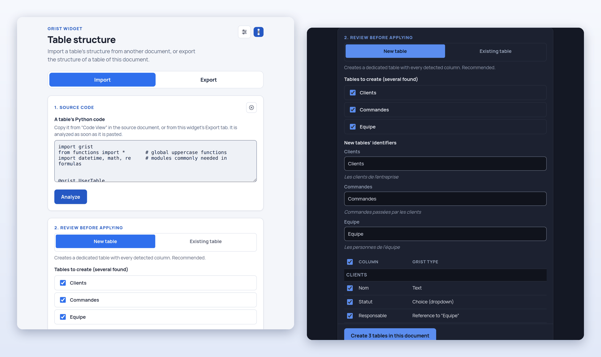

</div>

> The security document, [SECURITY.md](SECURITY.md), is written in French. The widget itself speaks French and English.

---

## At a glance

- 📥 **Import**: paste the Python code of a table (Grist's “Code View” menu, or the code of this widget's Export tab), check the preview column by column, then create the table(s) — or add only the missing columns to an existing table.
- 📤 **Export**: pick tables of **this** document, the columns and the elements to keep (labels, descriptions, choice lists and their colors, formats, the column a reference shows, two-way links, formulas), and copy the generated code.
- 🔒 **Safe by design**: the pasted text is never executed, nothing is written before you confirm, the widget only adds things, formulas are unticked by default and nothing leaves the browser.
- 🌗 **Polished**: French and English interface, light, dark or system theme, keyboard-friendly, in Grist Factory's colors.
- 🧩 **Light**: a static page in plain JavaScript, with no dependency and no build step.

> **Status: Beta.** The widget is complete and tested, but young: it copies the **structure** of a table (not its data, views, access rules or summary tables), it reads the Python code strictly, it asks for **full** access to the document and has only been tried in Chromium (see [Known limits](#known-limits)). A problem or an idea: open an [issue](https://github.com/grist-factory/export-table-structure/issues).

## Contents

[Why this widget?](#why-this-widget) ·
[Installation](#installation) ·
[Usage](#usage) ·
[What is copied](#what-is-copied) ·
[Security](#security) ·
[Known limits](#known-limits) ·
[Compatibility](#compatibility) ·
[Hosting](#hosting) ·
[FAQ](#faq) ·
[Visual identity](#visual-identity-grist-factory) ·
[Project layout](#project-layout) ·
[License](#license-and-credits)

## Why this widget?

In Grist, duplicating a table *with its data* is easy; recreating its **structure** in another document — the columns, their types, the references between tables, the choice lists and their colors, the formats — is slow and error-prone. This widget does it with a copy and a paste:

- **start a new document from an existing model** (a project tracker, a register, a directory…);
- **move from a test document to production** without retyping the columns;
- **share a table model** on a forum or with a colleague, as text, without exporting a single row of data;
- **keep a document's structure in a text file**, readable and versionable;
- **complete an existing table** with the columns of another, without touching what it already holds.

## Installation

The widget page is published with GitHub Pages:

```
https://grist-factory.github.io/export-table-structure/
```

1. In the Grist document, click **Add New** (green button, top left), then **Add Widget to Page**.
2. Choose the **Custom** widget type. Grist asks for a starting table: pick any, the widget does not read its rows.
3. In the right-hand panel, choose the custom URL option (*Custom URL*) and paste the address above.
4. Under **Access level**, choose **Full document access**. It is required to read the structure of the tables and to create some; the widget never reads or writes the rows of your tables (see [Access requested from Grist](#access-requested-from-grist)).

The two tabs, **Import** and **Export**, are ready. To host the widget on your own server, see [Hosting](#hosting).

## Usage

### Import

<p align="center">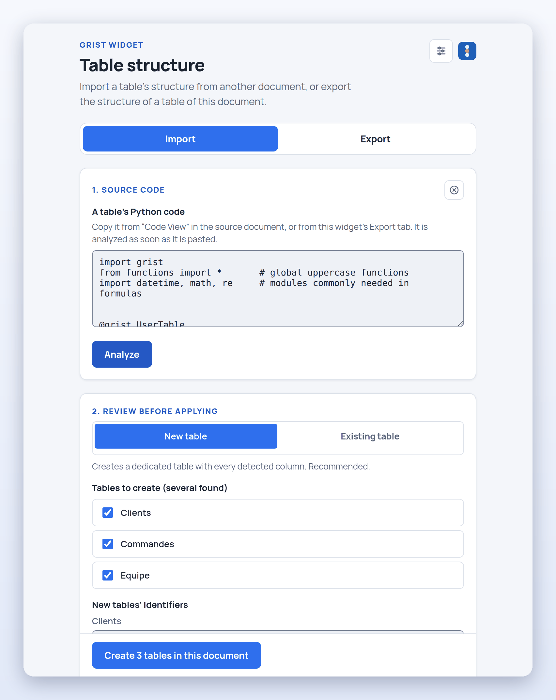</p>

1. **Get the code.** In the source document, open the table and its **Code View** menu — or use this widget's **Export** tab on that document.
2. **Paste it** in the **Import** tab: it is analyzed as soon as it is pasted (the **Analyze** button is for typed or edited text). It may contain several tables.
3. **Check the preview.** Each column shows its Grist type, its marks (“two-way”, “formula”…) and a checkbox to leave it out; each table has an identifier field (editable — references between the tables follow) and its description.

<p align="center">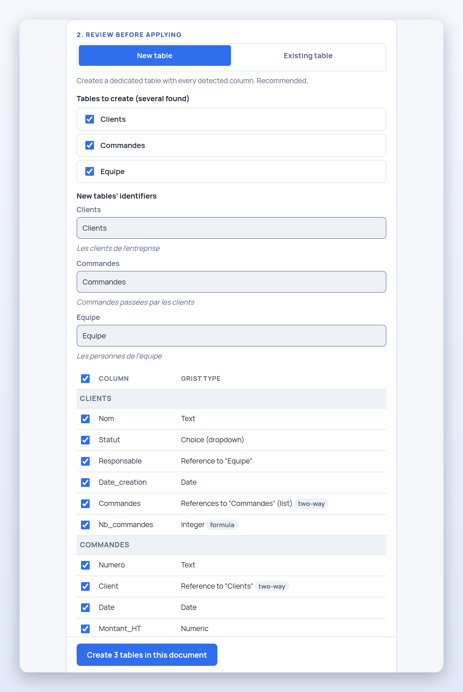</p>

4. **Choose what happens**:
   - **New table** (default): creates every ticked table at once, references included. An identifier that is already taken is refused before anything is written, and the button tells what to fix.
   - **Existing table**: adds **only the missing columns** to a table of the document. Columns that are already there, ignoring case, are marked “Already present” and left untouched; the new ones show up at once in the grids of that table.

<p align="center">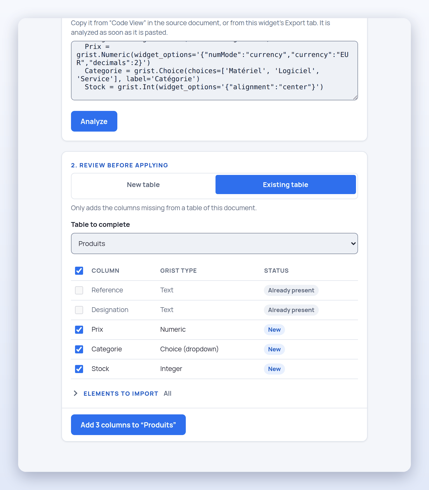</p>

5. **Choose the elements to copy.** Under the preview, the (folded) **Elements to import** group lists what the text holds beyond the type of the columns — labels, descriptions, choice lists, cell formats, the column a reference shows, two-way links, formulas — with the number of columns concerned. Everything is ticked, except formulas.

<p align="center">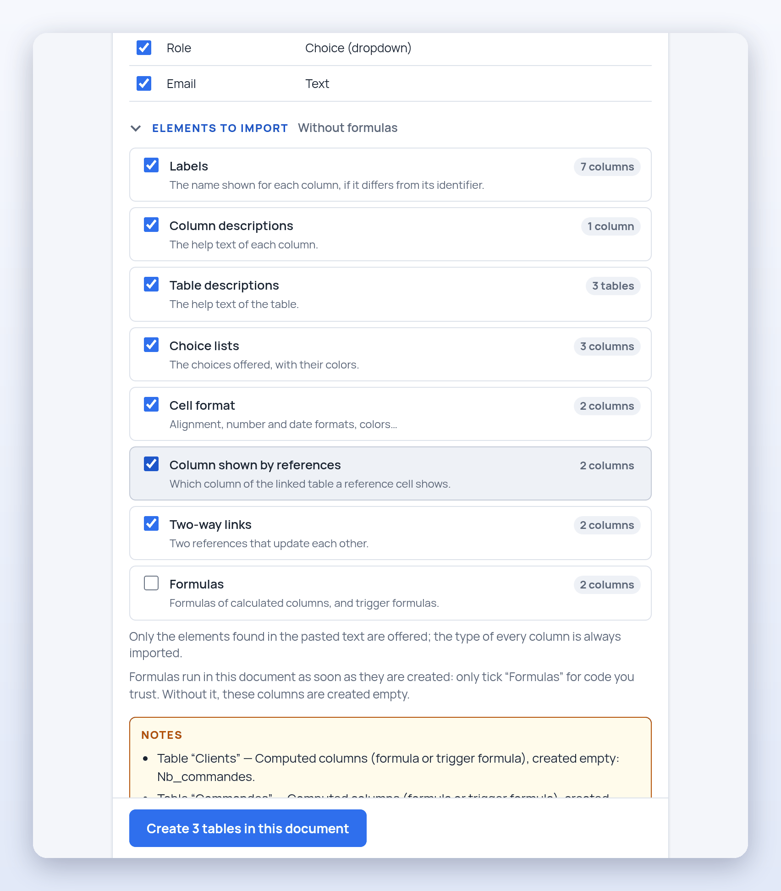</p>

6. **Confirm.** The action button opens a dialog that sums up what will be added, and **nothing is written until you confirm**. Cancel (or Escape) writes nothing and leaves the preview as it was.

<p align="center">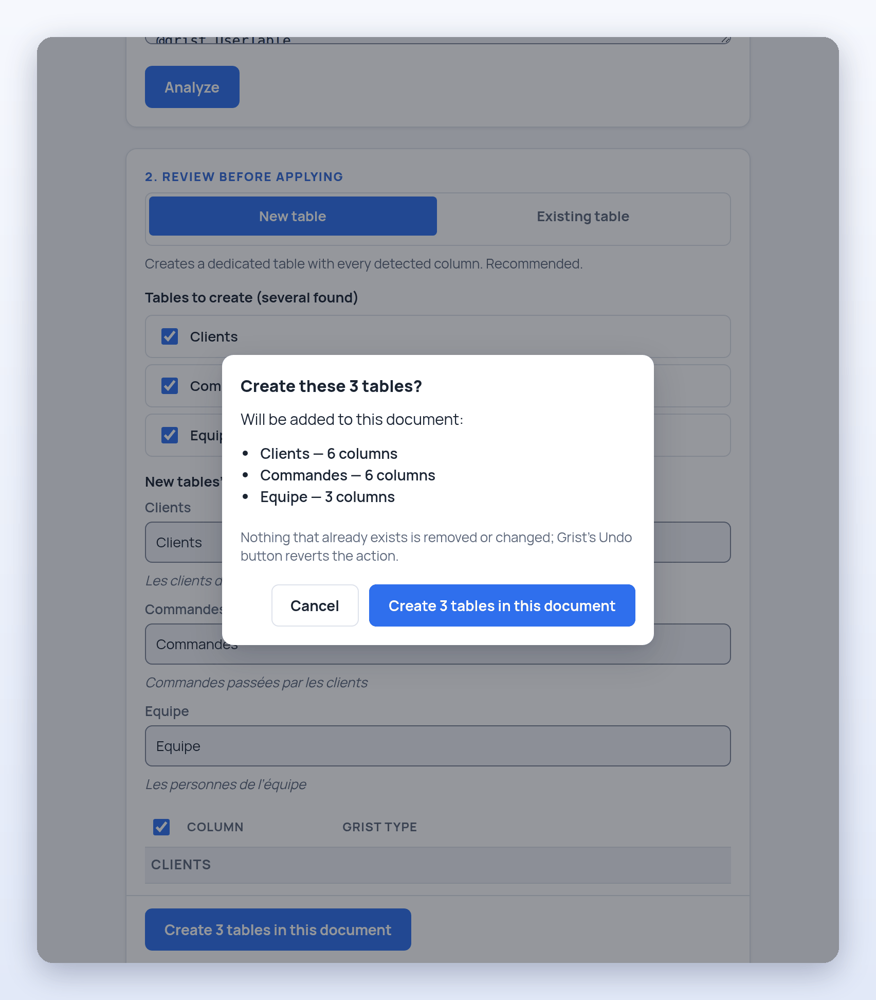</p>

When formulas are ticked, the confirmation warns that they will run in the document, and names those that call `REQUEST` (the Grist function that can send data to another server). In that case **Cancel** has the focus: confirming takes a deliberate click.

<p align="center">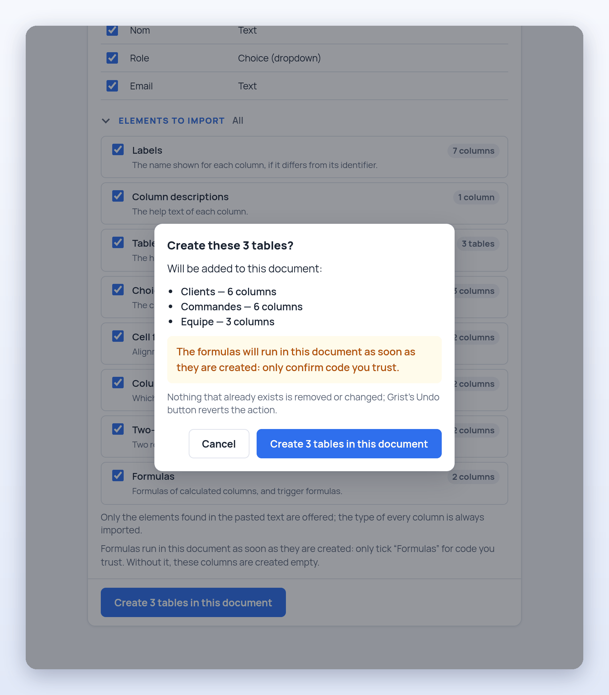</p>

**Undoing.** Grist's own **Undo** button (or Ctrl+Z / Cmd+Z, pressed outside the widget: the shortcut is not forwarded to Grist while the focus is inside the widget) undoes the import, step by step: one per call made to the document — the creation of the tables, then the column details (descriptions, displayed columns), then the two-way links, if any.

### Export

1. **Open the Export tab.** The tables of the document are loaded (the **Refresh the list** ↻ icon reads them again, keeping the ticked tables). From seven tables on, a search field filters the list as you type, ignoring case, accents and word order.
2. **Tick the tables** (**Select all** from two tables). The chevron › on each row unfolds its columns: untick those the code must not contain (the row then says “6 of 7 columns”).

<p align="center">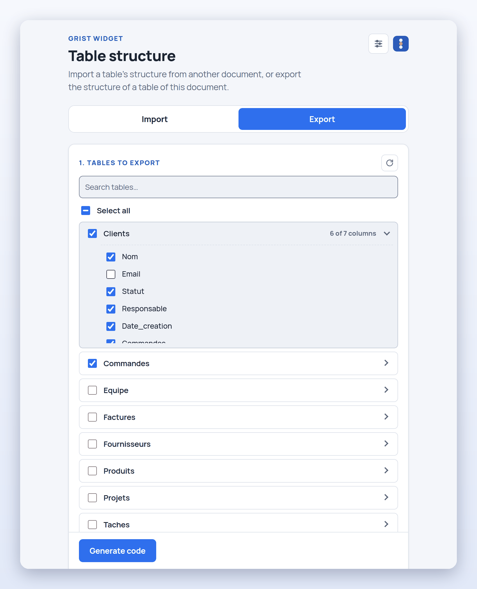</p>

3. **Referenced tables.** When a ticked table references a table that is not ticked, a banner says so: **Include this table**, or **Continue without it** (the column then becomes an `Any` type on import if the target table does not exist in the destination document either).

<p align="center">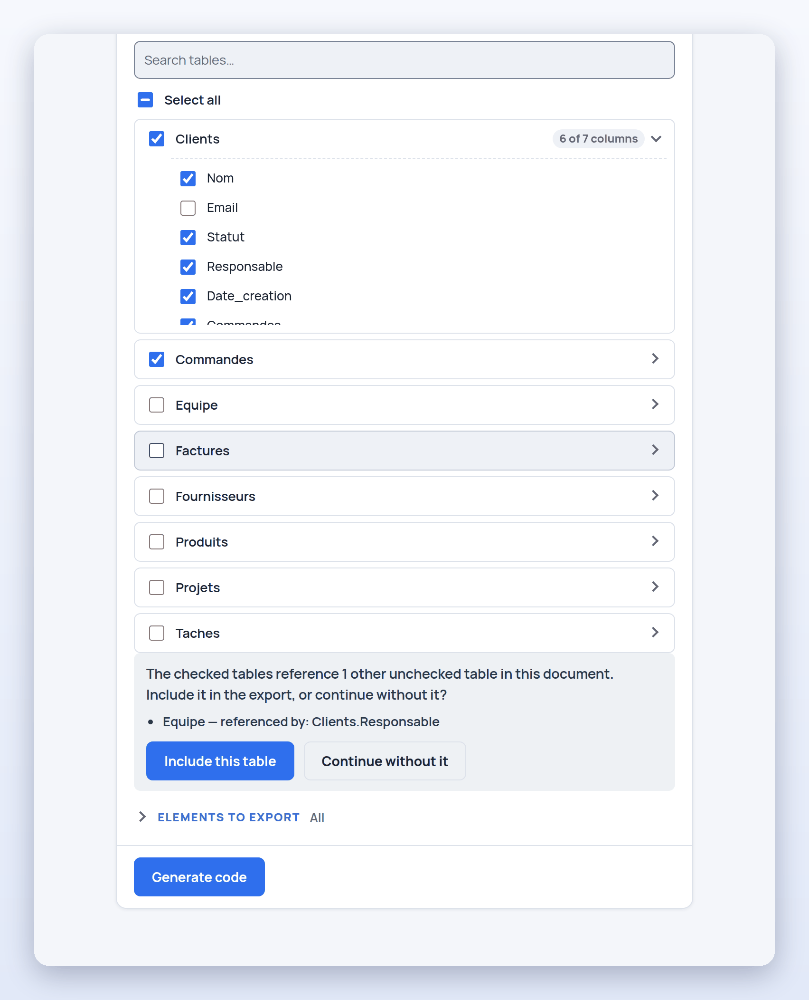</p>

4. **Generate and copy.** **Generate code** writes the code of the ticked tables, with the elements of the **Elements to export** group (everything is ticked by default, the type of each column is always exported). **Copy the code** puts it in the clipboard: paste it in this widget's **Import** tab, opened on another document.

<p align="center">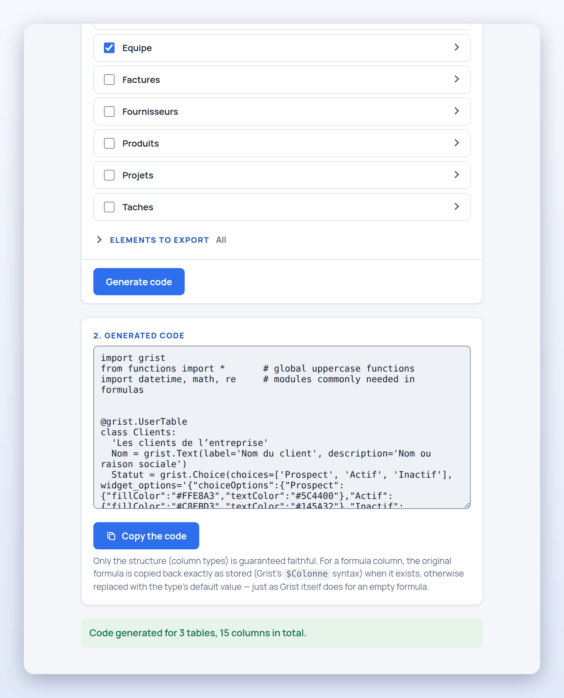</p>

The format follows Grist's real “Code View”: the same import lines at the top, the same `grist.Xxx(...)` expressions, the same order (data columns, then formula columns). Grist's system tables (`_grist_*`) and summary tables are not offered.

### Settings: theme and language

The icon at the top right opens the **Settings** panel: **system**, **light** or **dark** theme, **French** or **English** language, and credits. Both preferences (`gristFactory.theme` and `gristFactory.locale`) are kept in your browser's `localStorage` — and nothing else.

<p align="center">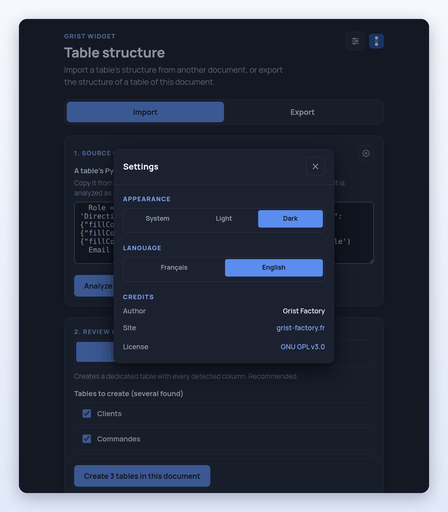</p>

## What is copied

The **type** of each column is always copied. The rest depends on the ticked elements — on import as on export:

| Element | What the code says about it |
| --- | --- |
| **Labels** | `label='…'`, when it differs from the identifier |
| **Column descriptions** | `description='…'` |
| **Table descriptions** | the string that opens the table's class (the description of its “Raw data” widget) |
| **Choice lists** | `choices=[…]` and the style of each choice (colors, bold…) |
| **Cell format** | the rest of `widget_options`: alignment, number and date formats, currency, colors… |
| **Column shown by references** | `visible_col='…'`: the column of the linked table that the cell shows |
| **Two-way links** | `reverse_of='…'`: two references that name each other stay linked |
| **Formulas** | formula columns and trigger formulas (unticked by default) |

<details>
<summary><strong>Type mapping</strong></summary>

This table works both ways: on import, to pick the type of the column created; on export, to write the expression that matches the real type.

| Written in the code | Grist column type |
| --- | --- |
| `grist.Text()` | Text |
| `grist.Numeric()` | Numeric |
| `grist.Int()` | Integer |
| `grist.Bool()` | Checkbox |
| `grist.Date()` | Date |
| `grist.DateTime('Zone')` | Date and time (given time zone, `UTC` by default) |
| `grist.Choice()` | Choice (dropdown) |
| `grist.ChoiceList()` | Multiple choice |
| `grist.Reference('Other_Table')` | Reference to `Other_Table` |
| `grist.ReferenceList('Other_Table')` | References to `Other_Table` (list) |
| `grist.Attachments()` | Attachments |
| `grist.Blob()` | Binary (`Blob`) |
| anything else / unrecognized type | Any (`Any`) |

A column written with `@grist.formulaType(...)` is a formula column; it is created without its formula unless the **Formulas** element is ticked. What the import does not copy is not lost silently: a note in the preview lists the computed columns (created empty), the two-way references that cannot be linked (created as plain references) and the options written in a form the widget does not read.

</details>

<details>
<summary><strong>Example of accepted code</strong></summary>

```python
import grist
from functions import *
import datetime, math, re

@grist.UserTable
class Clients:
  'The company’s customers'
  Nom = grist.Text(label='Customer name', description='Name or company name')
  Email = grist.Text()
  Statut = grist.Choice(choices=['Prospect', 'Active', 'Inactive'])
  Responsable = grist.Reference('Equipe', visible_col='Nom')
  Commandes = grist.ReferenceList('Commandes', reverse_of='Client')

  @grist.formulaType(grist.Int())
  def Nb_commandes(rec, table):
    return len($Commandes)
```

One text may hold several `@grist.UserTable` / `class … :` blocks: the widget finds them all. The text of a real Grist “Code View” is accepted as it is; it only gives the types, because Grist writes no labels, choices or options in it. The extra arguments (`label`, `description`, `choices`, `widget_options`, `visible_col`, `reverse_of`) are an extension of this widget, strictly additive, that only its **Import** tab recognizes.

Also accepted: comments (`# …`) at the end of a line or before the body of a class, the no-break spaces of a text copied from a web page, and the multi-line strings of a formula (written the way Grist does, before and since version 1.7.20).

</details>

<details>
<summary><strong>Two-way references and formulas, in detail</strong></summary>

**Two-way references.** Two columns that name each other (`reverse_of='Other'` on both sides, as the real Code View writes it) and are created **together** are linked by Grist, and their values stay in sync; the preview marks them “two-way”. A column whose counterpart is not created at the same time stays a plain reference, with a note: linking a column that already exists would rewrite its values, which this widget never does.

**Formulas.** Ticking **Formulas** creates formula columns with their formula, and data columns with their trigger formula (`def _default_…`). The text of the function is read as written: a lone `return X` becomes the formula `X`, multi-line functions stay as they are, and the value an empty formula returns gives a column without a formula, as in Grist. The **Export** tab writes formulas as Grist stores them (the `$Column` syntax); `rec.Column` is just as valid. The option is unticked by default **on purpose**: a formula is Python code that Grist runs in the document as soon as it is created, and a pasted text can come from anywhere.

</details>

## Security

Here is what protects you when you paste code in the Import tab:

| Protection | How |
| --- | --- |
| **The text is never executed** | It is only matched against fixed patterns and read by a character scanner: no `eval`, no `Function`, no dynamic import. What is not understood is ignored **and reported**. |
| **Never interpreted as HTML** | Everything that comes from the text is set through `textContent`; a Content Security Policy forbids inline scripts and any connection to a server (`connect-src 'none'`). |
| **What goes to Grist is filtered** | Table identifiers in the form Grist creates as they are, types from a known list, checked time zones, validated format options, Grist's reserved columns ignored. |
| **Formulas unticked by default** | Without the option, no column is created with a formula. With it, the confirmation warns and names those that call `REQUEST`. |
| **Confirmation before any write** | Cancel or Escape writes nothing; a double click or a held key is not a confirmation. |
| **Additions only** | No deletion or change of an existing table or column, no write into data rows. |
| **A booby-trapped text does not freeze the page** | The analysis is linear; the notes shown are limited to the first 100; reads and writes to Grist have a timeout. |

The details, with commands to check it yourself in a few seconds, are in [SECURITY.md](SECURITY.md) (in French). A vulnerability: do not open a public issue, use GitHub's private reporting (the repository's **Security** tab).

### Access requested from Grist

The widget asks for **full** access (`requiredAccess: "full"`), the only level that lets it read the structure of the document's tables (Grist's metadata tables) and create some. Grist asks the user to grant it when the widget is added. This is all it does with it, and nothing else:

| What | Widget API call | When |
| --- | --- | --- |
| Read the list of tables | `listTables` | Import: before creating, to refuse an identifier that is already taken |
| Read the structure of the tables | `fetchTable` on `_grist_Tables`, `_grist_Tables_column` and `_grist_Views_section` | Export (list, generation); Import (tables to complete, references, checks) |
| Create tables | `applyUserActions`: `AddTable` | Import “New table”, when the confirmed action button is clicked |
| Add columns | `applyUserActions`: `AddVisibleColumn` | Import “Existing table”, when the confirmed action button is clicked |
| Complete what has just been created | `applyUserActions`: `ModifyColumn`, `SetDisplayFormula`, `UpdateRecord` (a table's description) | Right after, on the only tables and columns that the previous call created |

- **The rows of a table are never read or written.**
- **Nothing leaves the browser**: the page loads nothing from another domain, and nothing is kept outside Grist, apart from two display preferences (theme and language: `gristFactory.theme` and `gristFactory.locale`) in the `localStorage`.
- **Two messages in the browser console** (“Applying inline style violates…” or “Refused to apply inline style…”) are normal: Grist's official API script creates a `<style>` tag for Grist's theme, which the widget's security policy refuses on purpose. No consequence.

## Known limits

The widget copies the **structure** of a table, and it does so strictly:

- **No data**: no rows, no access rules, no views and page widgets, no summary tables. The description of the table itself is copied for the tables the import creates; that of a table receiving columns is never modified.
- **Strict reading of the code**: complex constructor arguments (expressions, nested calls) are not interpreted; only the first text argument (target table, time zone) and the named arguments `choices=`, `widget_options=`, `label=`, `description=`, `visible_col=` and `reverse_of=` are read. Typographic quotes, `u'…'` strings, variable names and dictionaries are not read: the option concerned is ignored, with a warning.
- **Choice lists**: their values are copied only if they appear in the code as `choices=['A', 'B']`. A text pasted from the real Grist Code View does not hold them; the one from this widget's **Export** tab does.
- **References**: a column that references a table missing from the destination document (and not created at the same time) becomes `Any`, with a warning.
- **Identifiers**: Grist rewrites some column identifiers (`_x` becomes `x`, `class` becomes `cclass`): the widget follows the identifier actually created. A column named `grist` makes Grist itself fail: the error is shown and nothing is created.
- **Trigger formulas**: copied as the formula of new rows; the “recalculate when…” settings are not in the Code View and are not copied.
- **Very large texts** (thousands of tables, tens of thousands of columns): the preview becomes slow. Import in parts.
- **Browsers**: tried in Chromium; not yet in Firefox or Safari, nor with a screen reader.

## Compatibility

- **Grist**: the widget was validated against real **Grist 1.2.1** (October 2024), **1.7.20** and a development build of October 1, 2026 instances — Export → Import round trip of every column type, two-way references, formulas, and the widget mounted in Grist's real page. Before 1.2 the engine has no two-way references (tried on 1.1.10: the widget says so in its final message and creates plain references); before 1.1 it has no column description (1.0.5).
- **API used**: only the custom widget API (`ready`, `docApi.listTables`, `docApi.fetchTable`, `docApi.applyUserActions`). The automated validations ran on self-hosted Grist instances (official Docker images); the widget has not yet been validated the same way on Grist SaaS.
- **Accessibility**: click targets of at least 24 px, 4.5:1 contrasts, keyboard navigation, focus trapped in dialogs, automated axe-core check with no violation on the main screens. Not yet tried with a screen reader.

## Hosting

### GitHub Pages (default)

The [`.github/workflows/pages.yml`](.github/workflows/pages.yml) workflow publishes the site on every push to `main`. For your own copy: in **Settings → Pages**, choose the **GitHub Actions** source; the widget address is then the one GitHub Pages shows.

The page asks for Grist's official API at its own origin (`<script src="/grist-plugin-api.js">`, the form a Grist instance expects, which serves this file at its root). Pages is not an instance, so the workflow downloads the official API (`https://docs.getgrist.com/grist-plugin-api.js`) when publishing, places it next to `index.html` and points the tag at it: the published page contacts no other domain. The copy is the one of the last publication; running the workflow again (Actions tab, *Run workflow*) refreshes it. The file belongs to Grist Labs (Apache-2.0, see [`assets/grist-plugin-api.NOTICE.txt`](assets/grist-plugin-api.NOTICE.txt)).

### Closed network / self-hosted

Serve the files that `pages.yml` copies (`index.html`, `style.css`, `favicon.svg`, `js/`, `fonts/manrope/`, `assets/`) from any static host, and put **your** instance's file (`<your-grist>/grist-plugin-api.js`) next to `index.html`, with the tag `<script src="grist-plugin-api.js">`. If the widget is served by the same domain as Grist, keep `/grist-plugin-api.js`. Either way, nothing to change in the security policy. Without that file, both tabs say so (“Could not find the Grist API…”).

### Locally

```sh
git clone https://github.com/grist-factory/export-table-structure.git
cd export-table-structure
curl -o grist-plugin-api.js https://docs.getgrist.com/grist-plugin-api.js   # ignored by .gitignore
python3 -m http.server 8000                                                  # then http://localhost:8000/
```

## FAQ

<details>
<summary><strong>Does the widget change my data?</strong></summary>

No. It never reads or writes the rows of your tables. It reads the structure of the document and, after your confirmation, **adds** tables or columns to it. It removes or changes nothing that exists.
</details>

<details>
<summary><strong>Why does it ask for full access to the document?</strong></summary>

Because it is the only Grist level that lets a widget read the structure of the tables (the `_grist_*` metadata tables) and create some. The table [Access requested from Grist](#access-requested-from-grist) says exactly what is read and written, and when.
</details>

<details>
<summary><strong>Can I undo an import?</strong></summary>

Yes, with Grist's own **Undo** button: it undoes the import step by step (creation of the tables, then column details, then two-way links). Before anything is written, the **Cancel** button of the confirmation dialog (or Escape) writes nothing.
</details>

<details>
<summary><strong>Are imported formulas dangerous?</strong></summary>

A formula is Python code that Grist runs in the document. That is why the **Formulas** element is unticked by default, why the confirmation warns and names those that call `REQUEST`, and why **Cancel** then has the focus. Only tick it for a text you trust.
</details>

<details>
<summary><strong>Why did my import create an “Any” column?</strong></summary>

Because its type is not recognized, or it references a table that does not exist in the destination document. The preview says so in a note. Import the target table first (or tick it on export, through the banner of referenced tables).
</details>

<details>
<summary><strong>Does it work offline, on a closed Grist instance?</strong></summary>

Yes: the page contacts no domain other than the one serving it. See [Closed network / self-hosted](#closed-network--self-hosted).
</details>

## Visual identity (Grist Factory)

The interface follows the identity shared by the **Grist Factory** widgets ([grist-factory.fr](https://grist-factory.fr)):

- **Palette**: a neutral base and a single accent blue (`#2f6fed`) for actions and active states; red for errors, amber for the analysis notes, green for confirmations — never a color without a role. Rounded corners, soft shadows kept for floating elements. Four values of the charter are slightly darkened to reach 4.5:1 (WCAG AA).
- **Typography**: **Manrope** (variable font, SIL OFL license), served from [`fonts/manrope/`](fonts/manrope/) rather than a CDN — no extra network call. Python code stays in a monospace font.
- **Theme**: system, light or dark, remembered on the device.
- **Bilingual** French / English: every visible string is translated, singular/plural agreement included (“Table “X” created with 1 column.” / “… with 3 columns.”). The notes that end an import and the error messages returned by Grist stay in their original language, except the write refusal.
- **Icons**: outline SVGs written in `index.html`; no icon font, no external image.
- **Accessibility**: click targets of at least 24 px, visible focus that returns to the button just used, Tab and Shift+Tab kept inside dialogs, accessible names, announcements at the end of an analysis, tabs driven by arrows, Home and End, high-contrast mode.

## Project layout

```
index.html             the widget page (header, Settings panel, Import / Export tabs)
style.css              styling (Grist Factory identity, light / dark theme)
favicon.svg            icon
fonts/manrope/         vendored Manrope font and its source file
assets/                Grist Factory logo; notice for Grist's API (Apache-2.0)
docs/images/           screenshots of this README
js/theme-init.js       applies the remembered theme and language before the first paint
js/app.js              entry point: tabs, initialization
js/importTab.js        Import tab: assembles the modules below
js/importUi.js         ... the page elements the tab uses
js/importState.js      ... what the tab holds (analysis, choices, elements left out)
js/importView.js       ... what it shows (preview, warnings, buttons)
js/importFlow.js       ... what it does (analyze, clear, create, add columns)
js/importConfirm.js    ... the confirmation asked before writing to the document
js/importer.js         import logic without DOM: columns, identifiers, formulas, one-batch creation
js/exportTab.js        Export tab: reads the document and assembles the modules below
js/exportTables.js     ... the list of tables, its search and the Select all box
js/exportRefs.js       ... the banner of the referenced tables
js/exportOutput.js     ... the generated code and the Copy button
js/codeGenerator.js    writes the code of a schema, in the Code View format
js/schema.js           reads the document's structure from Grist's metadata tables
js/parser.js           reads the pasted code (fixed patterns and a bracket scanner, never executed)
js/pyText.js           Python text: literals, multi-line strings, arguments, comments
js/gristTypes.js       column types <-> Code View constructors
js/widgetOptions.js    what of a `widgetOptions` may travel from one document to another
js/elements.js         elements of a column (labels, choices, formulas…): counts and removal
js/elementsPicker.js   the group of checkboxes for those elements
js/search.js           list search: words, case and accents ignored
js/i18n.js             French and English texts
js/dom.js, util.js, storage.js, settings.js   DOM building without innerHTML, timeouts, preferences, Settings
SECURITY.md            the security posture, checkable (in French)
.github/workflows/     GitHub Pages publication
```

Code and comments are in English; the documentation is in French and English. No build step: these are native ES modules.

The test suite that validated this widget (unit tests, browser tests, tests against real Grist instances) is not published in this repository.

## Contributing

A bug, a text that does not go through, an idea: open an [issue](https://github.com/grist-factory/export-table-structure/issues), attaching if possible the pasted code (without sensitive data) and your Grist version. A security vulnerability: see [SECURITY.md](SECURITY.md#signaler-une-vulnérabilité).

## License and credits

- The widget is published under the **GNU GPL v3.0** ([LICENSE](LICENSE)), by [Grist Factory](https://grist-factory.fr).
- The **Manrope** font is under the SIL Open Font License ([`fonts/manrope/OFL.txt`](fonts/manrope/OFL.txt)).
- The `grist-plugin-api.js` script, published with the page, belongs to Grist Labs (Apache-2.0, [notice](assets/grist-plugin-api.NOTICE.txt)).
- Grist is a product of [Grist Labs](https://www.getgrist.com/); this widget is not affiliated with Grist Labs.
