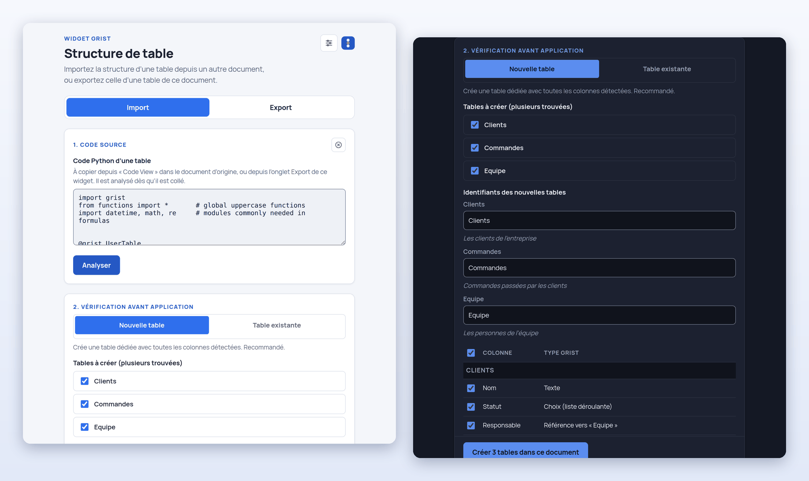
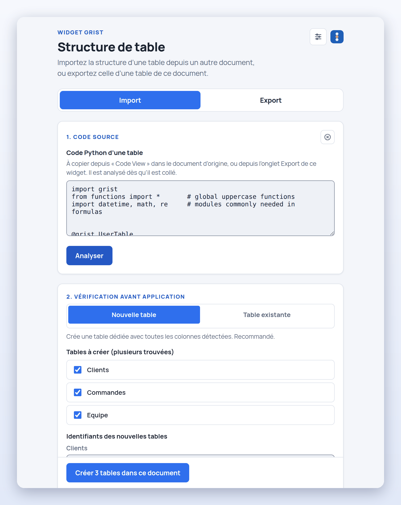
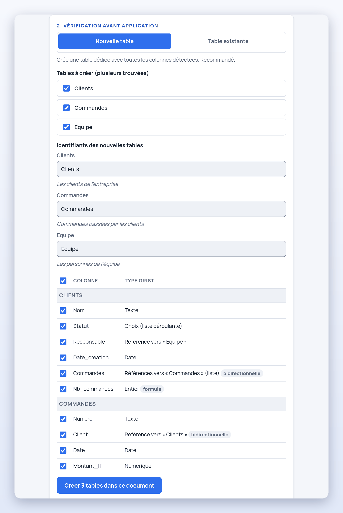
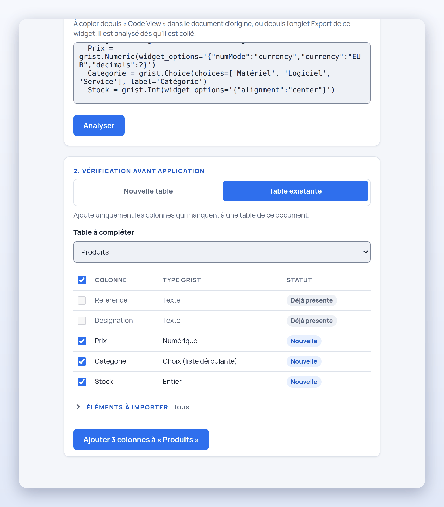
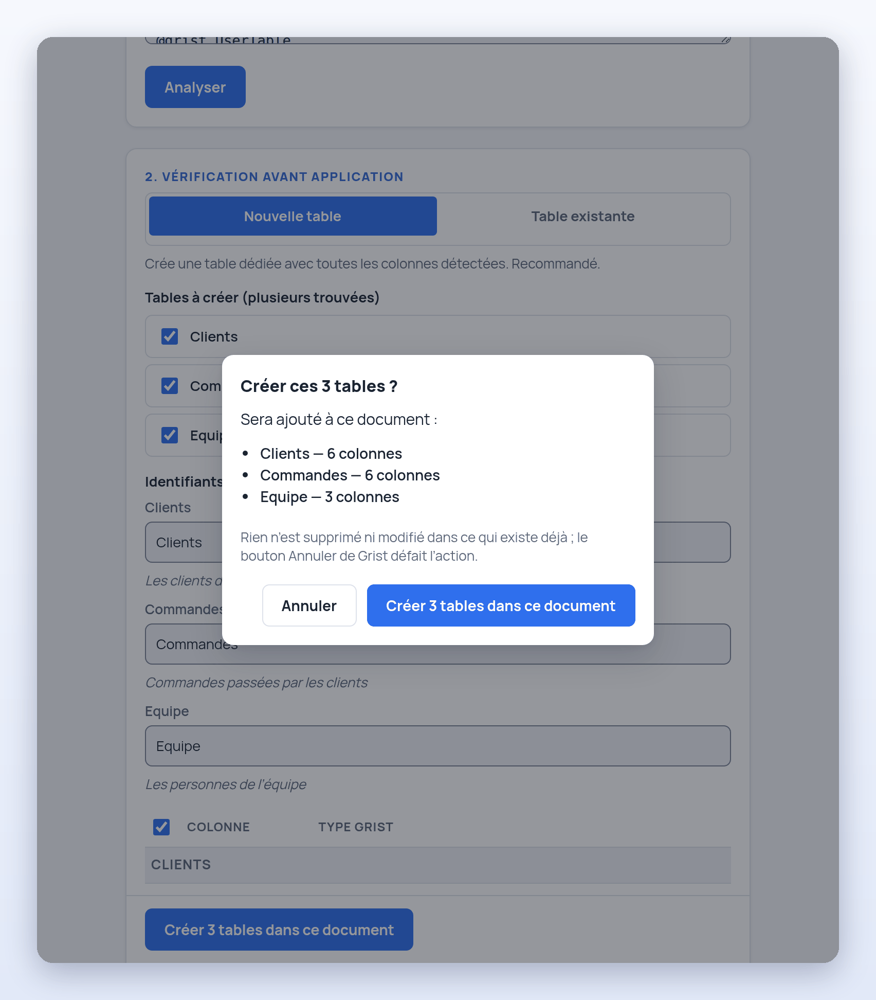
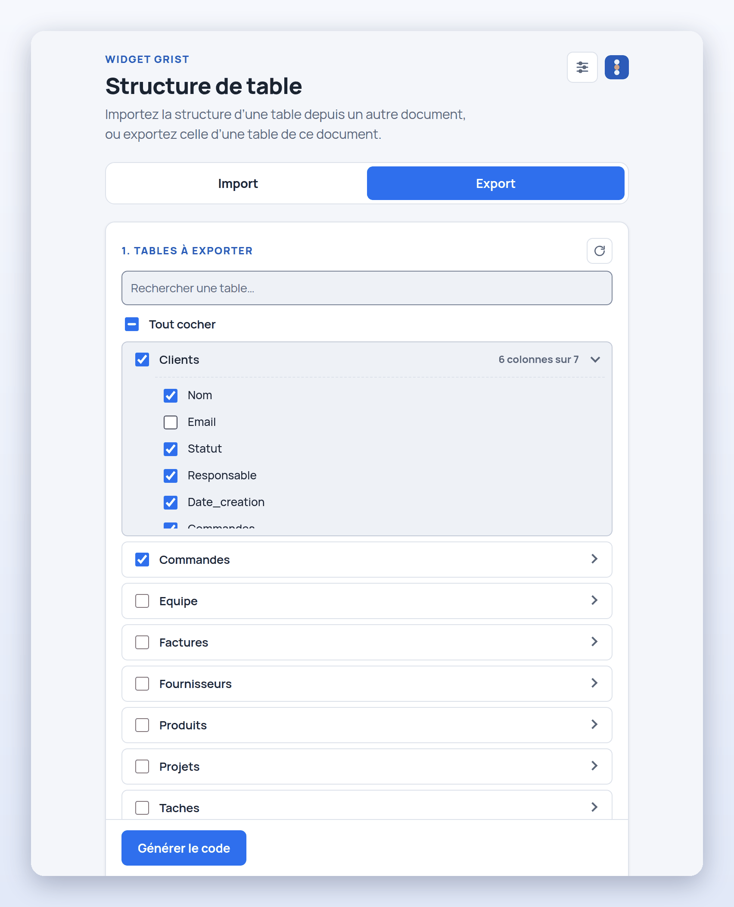
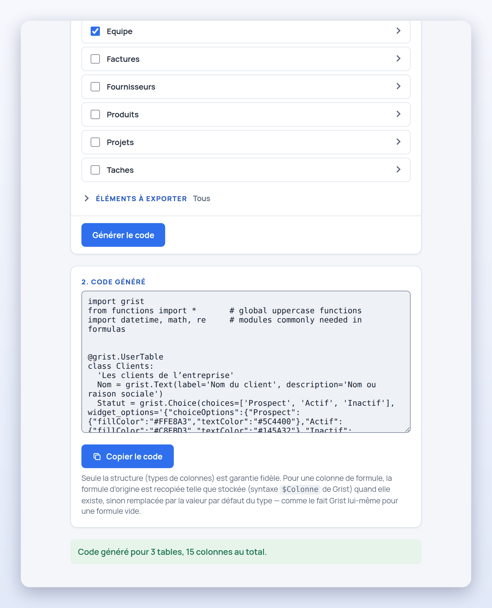
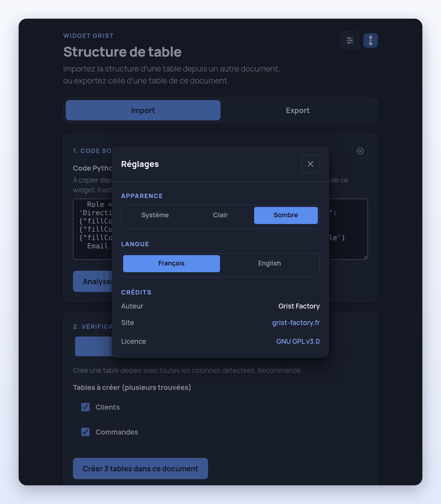

<div align="center">


# Structure de table Grist — Import / Export

**Copiez la structure d'une table d'un document Grist à un autre, sans rien ressaisir.**<br>
Un widget personnalisé de [Grist Factory](https://grist-factory.fr) pour [Grist](https://www.getgrist.com/).

[](#limites-connues)
[](CHANGELOG.md)
[](LICENSE)
[](#compatibilité)
[](SECURITY.md#dépendances)
[](#identité-visuelle-grist-factory)

**Français** · [English](README.en.md)



</div>

---

## En bref

- 📥 **Import** : collez le code Python d'une table (le menu « Code View » de Grist, ou celui de l'onglet Export), vérifiez l'aperçu colonne par colonne, puis créez la ou les tables — ou ajoutez seulement les colonnes qui manquent à une table existante.
- 📤 **Export** : choisissez des tables de **ce** document, les colonnes et les éléments à garder (libellés, descriptions, listes de choix et leurs couleurs, formats, colonne affichée des références, liens bidirectionnels, formules), et copiez le code généré.
- 🔒 **Sûr par construction** : le texte collé n'est jamais exécuté, rien n'est écrit avant votre confirmation, le widget ne fait que des ajouts, les formules sont décochées par défaut et rien ne sort du navigateur.
- 🌗 **Soigné** : interface en français et en anglais, thèmes clair, sombre ou système, accessible au clavier, aux couleurs de Grist Factory.
- 🧩 **Léger** : une page statique en JavaScript natif, sans dépendance ni étape de compilation.

> **Statut : Beta.** Le widget est complet et testé, mais jeune : il copie la **structure** d'une table (pas ses données, ses vues, ses droits d'accès ni ses tables de synthèse), il lit le code Python de façon stricte, il demande l'accès **complet** au document et n'a été essayé que dans Chromium (voir [Limites connues](#limites-connues)). Un problème ou une idée : ouvrez une [issue](https://github.com/grist-factory/export-table-structure/issues).

## Sommaire

[Pourquoi ce widget ?](#pourquoi-ce-widget-) ·
[Installation](#installation) ·
[Utilisation](#utilisation) ·
[Ce qui est repris](#ce-qui-est-repris) ·
[Sécurité](#sécurité) ·
[Limites connues](#limites-connues) ·
[Compatibilité](#compatibilité) ·
[Hébergement](#hébergement) ·
[Questions fréquentes](#questions-fréquentes) ·
[Identité visuelle](#identité-visuelle-grist-factory) ·
[Structure du projet](#structure-du-projet) ·
[Licence](#licence-et-crédits)

## Pourquoi ce widget ?

Dans Grist, dupliquer une table *avec ses données* est facile ; recréer sa **structure** dans un autre document — les colonnes, leurs types, les références entre tables, les listes de choix et leurs couleurs, les formats — est long et source d'oublis. Ce widget le fait en un copier-coller :

- **reprendre le modèle d'un document** pour en démarrer un nouveau (un suivi de projet, un registre, un annuaire…) ;
- **passer d'un document de test à la production**, sans retaper les colonnes ;
- **partager un modèle de table** sur le forum ou avec un collègue, sous forme de texte, sans exporter la moindre donnée ;
- **garder la structure d'un document dans un fichier texte**, lisible et versionnable ;
- **compléter une table existante** avec les colonnes d'une autre, sans toucher à ce qu'elle contient déjà.

## Installation

La page du widget est publiée avec GitHub Pages :

```
https://grist-factory.github.io/export-table-structure/
```

1. Dans le document Grist concerné, cliquez sur **Ajouter nouveau** (bouton vert en haut à gauche), puis **Ajouter un widget à la page**.
2. Choisissez le type **Personnalisé** (Custom). Grist demande une table de départ : prenez n'importe laquelle, le widget n'en lit pas les lignes.
3. Dans le panneau de droite, choisissez l'option d'URL personnalisée (*Custom URL*) et collez l'adresse ci-dessus.
4. Sous **Niveau d'accès**, choisissez **Accès complet au document**. C'est nécessaire pour lire la structure des tables et en créer ; le widget ne lit ni n'écrit jamais les lignes de vos tables (voir [Accès demandé à Grist](#accès-demandé-à-grist)).

Les deux onglets, **Import** et **Export**, sont alors prêts. Pour un hébergement sur votre propre serveur, voir [Hébergement](#hébergement).

## Utilisation

### Import

<p align="center"></p>

1. **Récupérez le code.** Dans le document source, ouvrez la table puis son menu **Code View** — ou utilisez l'onglet **Export** de ce même widget sur ce document.
2. **Collez-le** dans l'onglet **Import** : il est analysé dès qu'il est collé (le bouton **Analyser** sert pour un texte tapé ou modifié). Il peut contenir plusieurs tables.
3. **Vérifiez l'aperçu.** Chaque colonne a son type Grist, ses marques (« bidirectionnelle », « formule »…) et sa case à cocher pour l'exclure ; chaque table a un champ d'identifiant (modifiable, et les références entre les tables suivent) et sa description.

<p align="center"></p>

4. **Choisissez ce qui doit se passer** :
   - **Nouvelle table** (par défaut) : crée toutes les tables cochées en une seule fois, références comprises. Un identifiant déjà pris est refusé avant toute écriture, et le bouton dit ce qu'il faut corriger.
   - **Table existante** : ajoute **seulement les colonnes qui manquent** à une table du document. Les colonnes déjà présentes, sans tenir compte des majuscules, sont repérées « Déjà présente » et laissées intactes ; les nouvelles apparaissent tout de suite dans les grilles de cette table.

<p align="center"></p>

5. **Choisissez les éléments à reprendre.** Sous l'aperçu, le groupe **Éléments à importer** (replié) liste ce que le texte contient au-delà du type des colonnes — libellés, descriptions, listes de choix, formats de cellule, colonne affichée des références, liens bidirectionnels, formules — avec le nombre de colonnes concernées. Tout est coché, sauf les formules.

<p align="center"></p>

6. **Confirmez.** Le bouton d'action ouvre une boîte qui résume ce qui sera ajouté, et **rien n'est écrit avant que vous confirmiez**. Annuler (ou Échap) n'écrit rien et laisse l'aperçu tel quel.

<p align="center"></p>

Quand des formules sont cochées, la confirmation prévient qu'elles vont s'exécuter dans le document, et nomme celles qui appellent `REQUEST` (la fonction de Grist qui peut envoyer des données vers un autre serveur). Dans ce cas, c'est **Annuler** qui a le focus : confirmer demande un clic voulu.

<p align="center"></p>

**Revenir en arrière.** Le bouton **Annuler** de Grist (ou Ctrl+Z / Cmd+Z, pressé en dehors du widget : le raccourci n'est pas transmis à Grist quand le focus est dans le widget) défait l'import, étape par étape : une par appel fait au document — la création des tables, puis les détails des colonnes (descriptions, colonnes affichées), puis les liens bidirectionnels, s'il y en a.

### Export

1. **Ouvrez l'onglet Export.** La liste des tables du document se charge (l'icône **Actualiser la liste** ↻ la relit, sans perdre les tables cochées). À partir de sept tables, un champ de recherche filtre la liste au fil de la frappe, sans tenir compte des majuscules, des accents ni de l'ordre des mots.
2. **Cochez les tables** (**Tout cocher** dès deux tables). Le chevron › de chaque ligne déplie ses colonnes : décochez celles que le code ne doit pas contenir (la ligne dit alors « 6 colonnes sur 7 »).

<p align="center"></p>

3. **Tables référencées.** Si une table cochée référence une table non cochée, un bandeau l'indique : **Inclure cette table**, ou **Continuer sans elle** (la colonne deviendra alors un type `Any` à l'import si la table cible n'existe pas non plus dans le document de destination).

<p align="center"></p>

4. **Générez et copiez.** **Générer le code** écrit le code des tables cochées, avec les éléments du groupe **Éléments à exporter** (tout est coché par défaut, le type de chaque colonne est toujours exporté). **Copier le code** le met dans le presse-papiers : collez-le dans l'onglet **Import** de ce même widget, ouvert sur un autre document.

<p align="center"></p>

Le format suit celui de la vraie « Code View » de Grist : mêmes lignes d'import en en-tête, mêmes expressions `grist.Xxx(...)`, même ordre (colonnes de données, puis colonnes de formule). Les tables système de Grist (`_grist_*`) et les tables de synthèse ne sont pas proposées.

### Réglages : thème et langue

L'icône en haut à droite ouvre le panneau **Réglages** : thème **système**, **clair** ou **sombre**, langue **français** ou **anglais**, et crédits. Les deux préférences (`gristFactory.theme` et `gristFactory.locale`) sont gardées dans le `localStorage` de votre navigateur — et rien d'autre.

<p align="center"></p>

## Ce qui est repris

Le **type** de chaque colonne est toujours repris. Le reste dépend des éléments cochés — à l'import comme à l'export :

| Élément | Ce que le code en dit |
| --- | --- |
| **Libellés** | `label='…'`, quand il diffère de l'identifiant |
| **Descriptions des colonnes** | `description='…'` |
| **Descriptions des tables** | la chaîne qui ouvre la classe de la table (celle de son widget « Données brutes ») |
| **Listes de choix** | `choices=[…]` et le style de chaque choix (couleurs, gras…) |
| **Format des cellules** | le reste de `widget_options` : alignement, formats de nombre et de date, devise, couleurs… |
| **Colonne affichée des références** | `visible_col='…'` : la colonne de la table liée que montre la cellule |
| **Liens bidirectionnels** | `reverse_of='…'` : deux références qui se désignent restent liées |
| **Formules** | colonnes de formule et formules de déclenchement (décochées par défaut) |

<details>
<summary><strong>Correspondance des types</strong></summary>

Cette table sert dans les deux sens : à l'import, pour choisir le type de colonne créé ; à l'export, pour écrire l'expression qui correspond au vrai type.

| Écrit dans le code | Type de colonne Grist |
| --- | --- |
| `grist.Text()` | Texte |
| `grist.Numeric()` | Numérique |
| `grist.Int()` | Entier |
| `grist.Bool()` | Case à cocher |
| `grist.Date()` | Date |
| `grist.DateTime('Fuseau')` | Date et heure (fuseau donné, sinon `UTC` par défaut) |
| `grist.Choice()` | Choix (liste déroulante) |
| `grist.ChoiceList()` | Choix multiples |
| `grist.Reference('Autre_Table')` | Référence vers `Autre_Table` |
| `grist.ReferenceList('Autre_Table')` | Références vers `Autre_Table` (liste) |
| `grist.Attachments()` | Pièces jointes |
| `grist.Blob()` | Binaire (`Blob`) |
| tout le reste / type non reconnu | Quelconque (`Any`) |

Une colonne écrite avec `@grist.formulaType(...)` est une colonne de formule ; elle est créée sans formule tant que l'élément **Formules** n'est pas coché. Ce que l'import ne reprend pas n'est pas perdu en silence : une remarque de l'aperçu liste les colonnes calculées (créées vides), les références bidirectionnelles qui ne peuvent pas être reliées (créées comme références simples) et les options écrites sous une forme que le widget ne lit pas.

</details>

<details>
<summary><strong>Exemple de code accepté</strong></summary>

```python
import grist
from functions import *
import datetime, math, re

@grist.UserTable
class Clients:
  'Les clients de l’entreprise'
  Nom = grist.Text(label='Nom du client', description='Nom ou raison sociale')
  Email = grist.Text()
  Statut = grist.Choice(choices=['Prospect', 'Actif', 'Inactif'])
  Responsable = grist.Reference('Equipe', visible_col='Nom')
  Commandes = grist.ReferenceList('Commandes', reverse_of='Client')

  @grist.formulaType(grist.Int())
  def Nb_commandes(rec, table):
    return len($Commandes)
```

Un même texte peut contenir plusieurs blocs `@grist.UserTable` / `class … :` : le widget les repère tous. Le texte d'un vrai « Code View » de Grist est accepté tel quel ; il ne donne que les types, car Grist n'y écrit ni libellés, ni choix, ni options. Les arguments supplémentaires (`label`, `description`, `choices`, `widget_options`, `visible_col`, `reverse_of`) sont une extension de ce widget, strictement additive, que seul son onglet **Import** reconnaît.

Sont aussi acceptés : les commentaires (`# …`) en fin de ligne ou avant le corps d'une classe, les espaces insécables d'un texte copié depuis une page web, les chaînes sur plusieurs lignes d'une formule (écrites comme Grist le fait, avant et depuis la version 1.7.20).

</details>

<details>
<summary><strong>Références bidirectionnelles et formules, en détail</strong></summary>

**Références bidirectionnelles.** Deux colonnes qui se désignent l'une l'autre (`reverse_of='Autre'` des deux côtés, comme l'écrit la vraie Code View) et sont créées **ensemble** sont reliées par Grist, et leurs valeurs restent synchronisées ; l'aperçu les marque « bidirectionnelle ». Une colonne dont la réciproque n'est pas créée en même temps reste une référence simple, avec une remarque : relier une colonne qui existe déjà réécrirait ses valeurs, ce que ce widget ne fait jamais.

**Formules.** Cocher **Formules** crée les colonnes de formule avec leur formule, et les colonnes de données avec leur formule de déclenchement (`def _default_…`). Le texte de la fonction est lu tel qu'écrit : un `return X` seul devient la formule `X`, les fonctions de plusieurs lignes restent telles quelles, et la valeur que rend une formule vide donne une colonne sans formule, comme dans Grist. L'onglet **Export** écrit les formules telles que Grist les stocke (syntaxe `$Colonne`) ; `rec.Colonne` est tout aussi valide. L'option est décochée par défaut **volontairement** : une formule est du code Python que Grist exécute dans ce document dès sa création, et un texte collé peut venir de n'importe où.

</details>

## Sécurité

Voici ce qui protège quand on colle un code dans l'onglet Import :

| Protection | Comment |
| --- | --- |
| **Le texte n'est jamais exécuté** | Il est seulement comparé à des motifs fixes et lu par un scanner de caractères : pas d'`eval`, pas de `Function`, pas d'import dynamique. Ce qui n'est pas compris est ignoré **et signalé**. |
| **Jamais interprété comme du HTML** | Tout ce qui vient du texte est posé par `textContent` ; une politique de sécurité (CSP) interdit les scripts en ligne et toute connexion vers un serveur (`connect-src 'none'`). |
| **Ce qui part vers Grist est filtré** | Identifiants de table au format que Grist crée tel quel, types d'une liste connue, fuseaux horaires contrôlés, options de format validées, colonnes réservées de Grist ignorées. |
| **Formules décochées par défaut** | Sans l'option, aucune colonne n'est créée avec une formule. Avec elle, la confirmation prévient et nomme celles qui appellent `REQUEST`. |
| **Confirmation avant toute écriture** | Annuler ou Échap n'écrit rien ; un double clic ou une touche maintenue ne valent pas confirmation. |
| **Uniquement des ajouts** | Aucune suppression ni modification d'une table ou colonne existante, aucune écriture dans les lignes de données. |
| **Un texte piégé ne bloque pas la page** | L'analyse est linéaire ; les remarques affichées sont limitées aux 100 premières ; les lectures et écritures vers Grist ont un délai d'attente. |

Le détail, avec les commandes pour le vérifier soi-même en quelques secondes, est dans [SECURITY.md](SECURITY.md). Une faille : n'ouvrez pas d'issue publique, utilisez le signalement privé de GitHub (onglet **Security** du dépôt).

### Accès demandé à Grist

Le widget demande l'accès **complet** (`requiredAccess: "full"`), le seul niveau qui lui permet de lire la structure des tables du document (les tables de métadonnées de Grist) et d'en créer. Grist demande à l'utilisateur de l'accorder à l'ajout du widget. Voici tout ce qu'il en fait, et rien d'autre :

| Quoi | Appel de l'API du widget | Quand |
| --- | --- | --- |
| Lire la liste des tables | `listTables` | Import : avant de créer, pour refuser un identifiant déjà pris |
| Lire la structure des tables | `fetchTable` sur `_grist_Tables`, `_grist_Tables_column` et `_grist_Views_section` | Export (liste, génération) ; Import (tables à compléter, références, vérifications) |
| Créer des tables | `applyUserActions` : `AddTable` | Import « Nouvelle table », au clic sur le bouton d'action confirmé |
| Ajouter des colonnes | `applyUserActions` : `AddVisibleColumn` | Import « Table existante », au clic sur le bouton d'action confirmé |
| Compléter ce qui vient d'être créé | `applyUserActions` : `ModifyColumn`, `SetDisplayFormula`, `UpdateRecord` (description d'une table) | Juste après, sur les seules tables et colonnes que l'appel précédent a créées |

- **Les lignes d'une table ne sont jamais lues ni écrites.**
- **Rien ne sort du navigateur** : la page ne charge rien d'un autre domaine, et rien n'est conservé hors de Grist, hormis deux préférences d'affichage (thème et langue : `gristFactory.theme` et `gristFactory.locale`) dans le `localStorage`.
- **Deux messages dans la console du navigateur** (« Applying inline style violates… » ou « Refused to apply inline style… ») sont normaux : le script officiel de l'API de Grist crée une balise `<style>` pour le thème de Grist, que la politique de sécurité du widget refuse volontairement. Aucune conséquence.

## Limites connues

Le widget copie la **structure** d'une table, et il le fait strictement :

- **Pas de données** : ni les lignes, ni les droits d'accès, ni les vues et widgets de la page, ni les tables de synthèse. La description de la table elle-même est reprise pour les tables que l'import crée ; celle d'une table qui reçoit des colonnes n'est jamais modifiée.
- **Lecture stricte du code** : les arguments de constructeur complexes (expressions, appels imbriqués) ne sont pas interprétés ; seuls le premier argument texte (table cible, fuseau) et les arguments nommés `choices=`, `widget_options=`, `label=`, `description=`, `visible_col=` et `reverse_of=` sont lus. Les guillemets typographiques, les chaînes `u'…'`, les noms de variable et les dictionnaires ne sont pas lus : l'option concernée est ignorée, avec un avertissement.
- **Listes de choix** : leurs valeurs ne sont reprises que si elles figurent dans le code sous la forme `choices=['A', 'B']`. Un texte collé depuis la vraie Code View de Grist ne les contient pas ; celui de l'onglet **Export** de ce widget, si.
- **Références** : une colonne qui référence une table absente du document de destination (et non créée en même temps) devient `Any`, avec un avertissement.
- **Identifiants** : Grist réécrit certains identifiants de colonne (`_x` devient `x`, `class` devient `cclass`) : le widget suit l'identifiant réellement créé. Une colonne nommée `grist` fait échouer Grist lui-même : l'erreur est affichée et rien n'est créé.
- **Formules de déclenchement** : reprises comme formule des nouvelles lignes ; les réglages « recalculer quand… » ne figurent pas dans la Code View et ne sont pas repris.
- **Très gros textes** (des milliers de tables, des dizaines de milliers de colonnes) : l'aperçu devient lent. Importez par parties.
- **Navigateurs** : essayé dans Chromium ; pas encore sous Firefox ou Safari, ni avec un lecteur d'écran.

## Compatibilité

- **Grist** : le widget a été validé contre de vraies instances **Grist 1.2.1** (octobre 2024), **1.7.20** et une version de développement du 1er octobre 2026 — aller-retour Export → Import de chaque type de colonne, références bidirectionnelles, formules, et widget monté dans la vraie page de Grist. Avant 1.2, le moteur ne connaît pas les références bidirectionnelles (essayé sur 1.1.10 : le widget le dit dans le message de fin et crée des références simples) ; avant 1.1, il n'a pas de description de colonne (1.0.5).
- **API utilisée** : uniquement celle des widgets personnalisés (`ready`, `docApi.listTables`, `docApi.fetchTable`, `docApi.applyUserActions`). Les validations automatisées portent sur des instances Grist auto-hébergées (images Docker officielles) ; le widget n'a pas encore été validé de la même façon sur Grist SaaS.
- **Accessibilité** : zones cliquables d'au moins 24 px, contrastes de 4,5:1, navigation au clavier, focus piégé dans les boîtes de dialogue, contrôle automatisé axe-core sans violation sur les écrans principaux. Pas encore passé au lecteur d'écran.

## Hébergement

### GitHub Pages (par défaut)

Le workflow [`.github/workflows/pages.yml`](.github/workflows/pages.yml) publie le site à chaque envoi sur `main`. Pour votre propre copie : dans **Settings → Pages**, choisissez la source **GitHub Actions** ; l'adresse du widget est alors celle que GitHub Pages indique.

La page demande l'API officielle de Grist à sa propre origine (`<script src="/grist-plugin-api.js">`, la forme qu'attend une instance Grist, qui sert ce fichier à sa racine). Pages n'étant pas une instance, le workflow télécharge l'API officielle (`https://docs.getgrist.com/grist-plugin-api.js`) au moment de publier, la place à côté de `index.html` et fait pointer la balise dessus : la page publiée ne contacte aucun autre domaine. La copie est celle de la dernière publication ; relancer le workflow (onglet Actions, *Run workflow*) l'actualise. Le fichier appartient à Grist Labs (Apache-2.0, voir [`assets/grist-plugin-api.NOTICE.txt`](assets/grist-plugin-api.NOTICE.txt)).

### Réseau fermé / auto-hébergé

Servez les fichiers que copie `pages.yml` (`index.html`, `style.css`, `favicon.svg`, `js/`, `fonts/manrope/`, `assets/`) par n'importe quel hébergement statique, et mettez à côté de `index.html` le fichier de **votre** instance (`<votre-grist>/grist-plugin-api.js`), avec la balise `<script src="grist-plugin-api.js">`. Si le widget est servi par le même domaine que Grist, laissez `/grist-plugin-api.js`. Dans les deux cas, rien à changer à la politique de sécurité. Sans ce fichier, les deux onglets le disent (« Impossible de trouver l'API Grist… »).

### En local

```sh
git clone https://github.com/grist-factory/export-table-structure.git
cd export-table-structure
curl -o grist-plugin-api.js https://docs.getgrist.com/grist-plugin-api.js   # ignoré par .gitignore
python3 -m http.server 8000                                                  # puis http://localhost:8000/
```

## Questions fréquentes

<details>
<summary><strong>Le widget modifie-t-il mes données ?</strong></summary>

Non. Il ne lit ni n'écrit jamais les lignes de vos tables. Il lit la structure du document et, après votre confirmation, y **ajoute** des tables ou des colonnes. Il ne supprime ni ne modifie rien de ce qui existe.
</details>

<details>
<summary><strong>Pourquoi demande-t-il l'accès complet au document ?</strong></summary>

Parce que c'est le seul niveau de Grist qui permet de lire la structure des tables (les tables de métadonnées `_grist_*`) et d'en créer. Le tableau [Accès demandé à Grist](#accès-demandé-à-grist) dit exactement ce qui est lu et écrit, et quand.
</details>

<details>
<summary><strong>Puis-je annuler un import ?</strong></summary>

Oui, avec le bouton **Annuler** de Grist : il défait l'import étape par étape (création des tables, puis détails des colonnes, puis liens bidirectionnels). Avant d'écrire, le bouton **Annuler** de la boîte de confirmation (ou Échap) n'écrit rien.
</details>

<details>
<summary><strong>Les formules importées sont-elles dangereuses ?</strong></summary>

Une formule est du code Python que Grist exécute dans le document. C'est pourquoi l'élément **Formules** est décoché par défaut, que la confirmation prévient et nomme celles qui appellent `REQUEST`, et que **Annuler** a alors le focus. Ne le cochez que pour un texte de confiance.
</details>

<details>
<summary><strong>Pourquoi mon import crée-t-il une colonne de type « Quelconque » ?</strong></summary>

Parce que son type n'est pas reconnu, ou qu'elle référence une table qui n'existe pas dans le document de destination. L'aperçu le dit dans une remarque. Importez d'abord la table cible (ou cochez-la à l'export, via le bandeau des tables référencées).
</details>

<details>
<summary><strong>Fonctionne-t-il hors ligne, sur une instance Grist fermée ?</strong></summary>

Oui : la page ne contacte aucun autre domaine que celui qui la sert. Voir [Réseau fermé / auto-hébergé](#réseau-fermé--auto-hébergé).
</details>

## Identité visuelle (Grist Factory)

L'interface suit l'identité commune aux widgets **Grist Factory** ([grist-factory.fr](https://grist-factory.fr)) :

- **Palette** : une base neutre et un seul bleu d'accent (`#2f6fed`) pour les actions et états actifs ; rouge pour les erreurs, ambre pour les remarques de l'analyse, vert pour les confirmations — jamais de couleur sans rôle. Coins arrondis, ombres douces réservées aux éléments flottants. Quatre valeurs de la charte sont légèrement assombries pour atteindre 4,5:1 (WCAG AA).
- **Typographie** : **Manrope** (police variable, licence SIL OFL), servie depuis [`fonts/manrope/`](fonts/manrope/) plutôt que depuis une CDN — aucun appel réseau de plus. Le code Python reste en police à chasse fixe.
- **Thème** système, clair ou sombre, mémorisé sur l'appareil.
- **Bilingue** français / anglais : toute chaîne visible est traduite, accords singulier/pluriel compris (« Table « X » créée avec 1 colonne. » / « … avec 3 colonnes. »). Les notes de fin d'import et les messages d'erreur renvoyés par Grist restent dans leur langue d'origine, sauf le refus d'écriture.
- **Icônes** : des SVG en contour, écrits dans `index.html` ; ni police d'icônes, ni image externe.
- **Accessibilité** : zones cliquables d'au moins 24 px, focus visible qui revient au bouton actionné, Tab et Maj+Tab gardés dans les boîtes de dialogue, noms accessibles, annonces de fin d'analyse, onglets pilotés aux flèches, Début et Fin, mode contraste élevé.

## Structure du projet

```
index.html             page du widget (en-tête, panneau Réglages, onglets Import / Export)
style.css              mise en forme (identité Grist Factory, thème clair / sombre)
favicon.svg            icône
fonts/manrope/         police Manrope vendorisée et son fichier d'origine
assets/                logo Grist Factory ; mention de l'API de Grist (Apache-2.0)
docs/images/           captures d'écran de ce README
js/theme-init.js       applique le thème et la langue mémorisés avant le premier affichage
js/app.js              point d'entrée : onglets, initialisation
js/importTab.js        onglet Import : assemble les modules ci-dessous
js/importUi.js         ... les éléments de la page que l'onglet utilise
js/importState.js      ... ce que l'onglet retient (analyse, choix, éléments laissés de côté)
js/importView.js       ... ce qu'il affiche (aperçu, avertissements, boutons)
js/importFlow.js       ... ce qu'il fait (analyser, effacer, créer, ajouter des colonnes)
js/importConfirm.js    ... la confirmation demandée avant d'écrire dans le document
js/importer.js         logique de l'import sans DOM : colonnes, identifiants, formules, création en un lot
js/exportTab.js        onglet Export : lit le document et assemble les modules ci-dessous
js/exportTables.js     ... la liste des tables, sa recherche et la case « Tout cocher »
js/exportRefs.js       ... le bandeau des tables référencées
js/exportOutput.js     ... le code généré et le bouton Copier
js/codeGenerator.js    écrit le code d'un schéma, au format de la Code View
js/schema.js           lit la structure du document dans les tables de métadonnées de Grist
js/parser.js           lit le code collé (motifs fixes et scanner de parenthèses, jamais exécuté)
js/pyText.js           texte Python : littéraux, chaînes sur plusieurs lignes, arguments, commentaires
js/gristTypes.js       types de colonne <-> constructeurs Code View
js/widgetOptions.js    ce qui d'un `widgetOptions` peut voyager d'un document à l'autre
js/elements.js         éléments d'une colonne (libellés, choix, formules…) : comptes et retrait
js/elementsPicker.js   le groupe de cases à cocher de ces éléments
js/search.js           recherche dans une liste : mots, casse et accents ignorés
js/i18n.js             textes français et anglais
js/dom.js, util.js, storage.js, settings.js   construction du DOM sans innerHTML, délais d'attente, préférences, Réglages
SECURITY.md            la posture de sécurité, vérifiable
.github/workflows/     publication GitHub Pages
```

Le code et ses commentaires sont en anglais ; la documentation est en français et en anglais. Aucune étape de compilation : ce sont des modules ES natifs.

La suite de tests qui a validé ce widget (tests unitaires, tests dans un navigateur, tests contre de vraies instances Grist) n'est pas publiée dans ce dépôt.

## Contribuer

Un bug, un cas de texte qui ne passe pas, une idée : ouvrez une [issue](https://github.com/grist-factory/export-table-structure/issues) en joignant, si possible, le code collé (sans donnée sensible) et la version de Grist. Une faille de sécurité : voir [SECURITY.md](SECURITY.md#signaler-une-vulnérabilité).

## Licence et crédits

- Le widget est publié sous licence **GNU GPL v3.0** ([LICENSE](LICENSE)), par [Grist Factory](https://grist-factory.fr).
- La police **Manrope** est sous licence SIL Open Font License ([`fonts/manrope/OFL.txt`](fonts/manrope/OFL.txt)).
- Le script `grist-plugin-api.js`, publié avec la page, appartient à Grist Labs (Apache-2.0, [mention](assets/grist-plugin-api.NOTICE.txt)).
- Grist est un produit de [Grist Labs](https://www.getgrist.com/) ; ce widget n'est pas affilié à Grist Labs.
